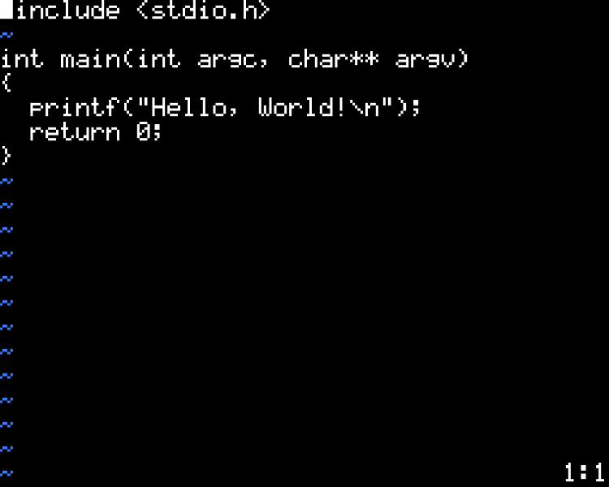

# pico-vim
Simple vim-like editor using p5.js and libraries made by [RandomGamingDev](https://github.com/RandomGamingDev/).



How to run:
```
$ git clone https://github.com/Nyaaboron/pico-vim.git && cd pico-vim
$ firefox index.html
   ^^^ it doesn't have to be firefox. You can use other browsers
```
